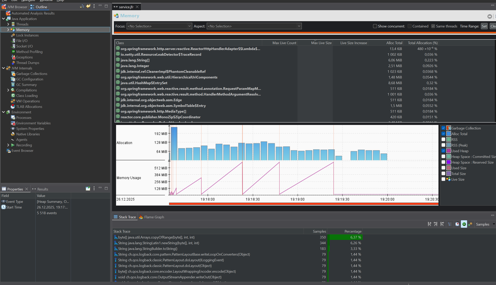
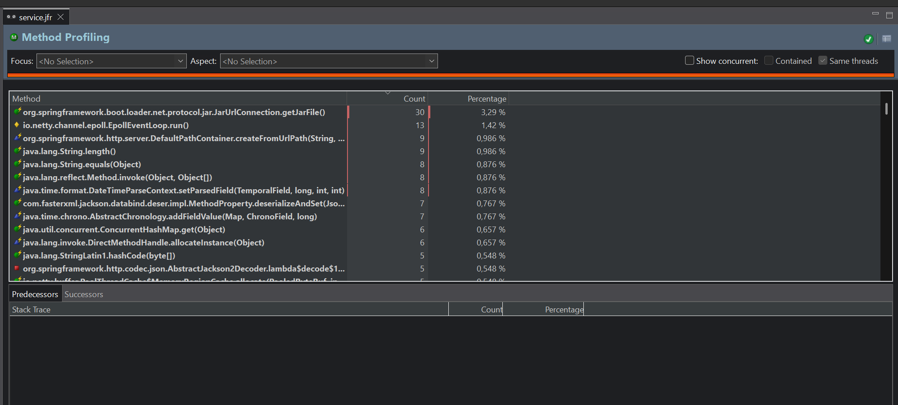
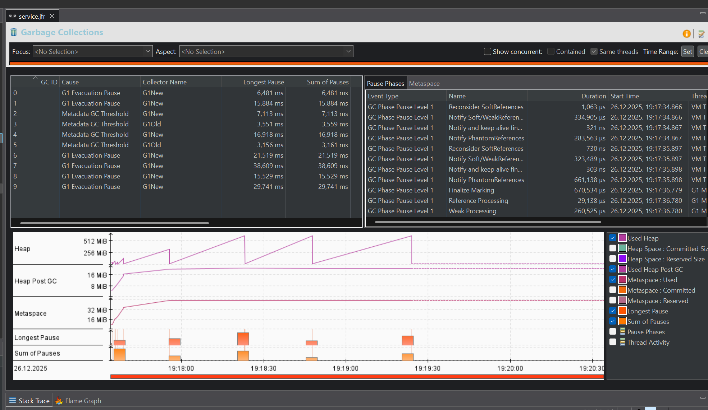
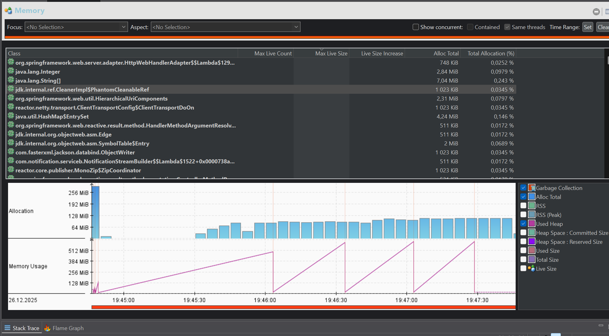
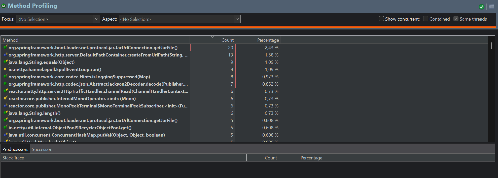
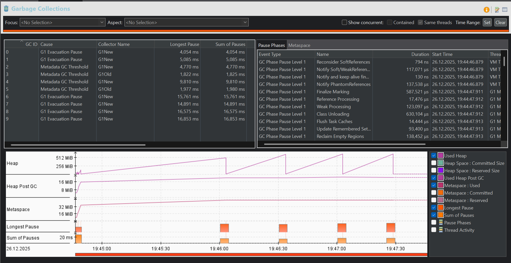

# Профилирование и оптимизация

## 1. Выявленные проблемы (JFR)

Memory Hot Spots



CPU Hot Spots



GC Метрики



## 2. Тесты после оптимизации

Memory Hot Spots



CPU Hot Spots



GC Метрики



# Notification Service - Reactive Spring Boot Application

Полноценное приложение с реактивным программированием на Spring Boot 3.x с использованием Project Reactor и WebFlux.

## Архитектура

Приложение состоит из двух основных компонентов:

### Service A (Клиент - Port 8080)
- **GET /api/client/notifications** - Получение потока уведомлений через WebClient
- Отправляет HTTP запросы к Service B
- Обрабатывает `Flux<NotificationDto>` с потоком данных
- Реализует timeout 20 секунд
- Логирует получаемые уведомления

### Service B (Сервер - Port 8080)
- **GET /api/notifications/stream** - Возвращает реактивный поток уведомлений
- Генерирует поток из разных источников (SYSTEM, USER, SOCIAL)
- Поддерживает фильтрацию по типам
- Поддерживает ограничение количества (limit)
- Graceful shutdown при разрыве соединения

## Технический стек

- **Spring Boot 3.2.1** - WebFlux для реактивности
- **Java 17**
- **PostgreSQL 16** - Основная БД
- **Project Reactor** - Реактивное программирование
- **Spring Data R2DBC** - Реактивный доступ к БД
- **Lombok** - Генерация кода
- **Maven** - Build инструмент
- **Docker & Docker Compose** - Контейнеризация
- **Flyway** - Миграции БД
- **SLF4J** - Логирование

## Типы уведомлений

### SYSTEM
- Системные уведомления от приложения
- Примеры: Обновления, техническое обслуживание, безопасность

### USER
- Уведомления от других пользователей
- Примеры: Сообщения, упоминания, запросы

### SOCIAL
- Социальные уведомления
- Примеры: Лайки, комментарии, подписки

## Запуск приложения

### Вариант 1: Docker Compose (рекомендуется)

```bash
# Запустить контейнеры
make docker-up

# Приложение будет доступно на http://localhost:8080
```

### Вариант 2: Локальный запуск

Требования:
- PostgreSQL запущен на localhost:5432
- PostgreSQL пользователь: `notification_user` с паролем `notification_pass`
- Database: `notification_db`

```bash
# Собрать проект
make build

# Запустить приложение
make run

# Приложение будет доступно на http://localhost:8080
```

## Примеры запросов (cURL)

### Service A - Получение потока уведомлений через клиент

```bash
# Базовый запрос
curl -N http://localhost:8080/api/client/notifications?userId=1

# С фильтром по типу
curl -N http://localhost:8080/api/client/notifications?userId=1&filter=SYSTEM

# С ограничением количества
curl -N http://localhost:8080/api/client/notifications?userId=1&limit=5

# Комбинированный запрос
curl -N http://localhost:8080/api/client/notifications?userId=1&limit=10&filter=USER

# Сохранение в файл
curl -N http://localhost:8080/api/client/notifications?userId=1 > notifications.jsonl

# С вывод в реальном времени (каждая строка - JSON объект)
curl -N http://localhost:8080/api/client/notifications?userId=1 | jq
```

### Service B - Прямой запрос к серверу

```bash
# Базовый запрос к Stream API
curl -N http://localhost:8080/api/notifications/stream?userId=1

# С фильтром
curl -N http://localhost:8080/api/notifications/stream?userId=1&filter=SOCIAL

# С лимитом
curl -N http://localhost:8080/api/notifications/stream?userId=1&limit=3
```

### Health Checks

```bash
# Проверка Service A
curl http://localhost:8080/api/client/health

# Проверка Service B
curl http://localhost:8080/api/notifications/health
```

## Параметры запросов

### userId (обязательный)
- Тип: Long
- Описание: ID пользователя
- Пример: `userId=1`

### limit (опциональный)
- Тип: Integer
- Описание: Максимальное количество уведомлений
- По умолчанию: нет ограничения
- Пример: `limit=10`

### filter (опциональный)
- Тип: String
- Описание: Фильтр по типу уведомления (SYSTEM, USER, SOCIAL)
- Пример: `filter=SYSTEM`

## Логирование

### LoggingFilter

Логирует все HTTP запросы и ответы:
- Метод запроса (GET, POST, etc.)
- Path запроса
- Query параметры
- Status код ответа
- Время выполнения (ms)

Пример лога:
```
18:45:23.123 [reactor-http-nio-2] INFO LoggingFilter - HTTP REQUEST - Method: GET, Path: /api/client/notifications, QueryParams: userId=1&limit=5
18:45:23.456 [reactor-http-nio-2] INFO LoggingFilter - HTTP RESPONSE - Method: GET, Path: /api/client/notifications, Status: 200, Duration: 333ms
```

### NotificationStreamBuilder

Логирует процесс построения потока:
```
18:45:23.100 [main] DEBUG NotificationStreamBuilder - Building notification stream for userId: 1, limit: 5, filter: null
18:45:23.200 [main] INFO NotificationStreamBuilder - Generated 9 notifications for userId: 1
18:45:23.300 [reactor-http-nio-2] DEBUG NotificationStreamBuilder - Formatted notification: id=0, type=SYSTEM, title=[SYSTEM] System Notification 1
18:45:23.450 [reactor-http-nio-2] INFO NotificationStreamBuilder - Notification stream completed for userId: 1
```

### NotificationClientController

Логирует действия клиента:
```
18:45:23.050 [reactor-http-nio-2] INFO NotificationClientController - Client received request - userId: 1, limit: 5, filter: null
18:45:23.100 [reactor-http-nio-2] INFO NotificationClientController - Sending WebClient request to Service B for userId: 1
18:45:23.310 [reactor-http-nio-2] DEBUG NotificationClientController - Received notification from Service B - id: 0, type: SYSTEM, title: [SYSTEM] System Notification 1
18:45:23.450 [reactor-http-nio-2] INFO NotificationClientController - Notification stream completed for userId: 1
```

## Обработка ошибок

### Валидация параметров
- `userId` должен быть положительным числом
- `limit` должен быть положительным числом
- При неверных параметрах возвращается 400 Bad Request

### Timeout
- Клиент имеет timeout 20 секунд на запрос к серверу
- При timeout выбрасывается ошибка с логированием
- Соединение gracefully закрывается

### Обработка исключений
Все исключения перехватываются через `GlobalExceptionHandler`:
- `IllegalArgumentException` → 400 Bad Request
- `RuntimeException` → 500 Internal Server Error
- Остальные исключения → 500 Internal Server Error

Ответ ошибки:
```json
{
  "status": 400,
  "message": "userId must be positive",
  "error": "Validation Error",
  "timestamp": "2024-01-18 18:45:23",
  "path": "/api/client/notifications"
}
```

## Makefile команды

```bash
# Справка по всем командам
make help

# Сборка проекта
make build

# Очистка артефактов
make clean

# Локальный запуск (требует PostgreSQL)
make run

# Запуск Docker контейнеров
make docker-up

# Остановка Docker контейнеров
make docker-down

# Просмотр логов приложения
make docker-logs

# Просмотр логов PostgreSQL
make docker-logs-postgres

# Запуск тестов
make test

# Установка зависимостей
make install-deps

# Перестройка Docker образа
make rebuild-docker

# Список запущенных контейнеров
make ps

# Подключение к PostgreSQL
make shell-postgres

# Проверка здоровья сервисов
make health-check
```


### Graceful Shutdown
- При отключении клиента поток gracefully закрывается
- В логах отображается `CANCEL` или `COMPLETE` сигнал
- Все ресурсы освобождаются корректно

### Обработка потока
- Используется `Flux.fromIterable()` для преобразования List в поток
- Используется `flatMap()` для асинхронного форматирования
- Используется `doOnNext()`, `doOnError()`, `doOnComplete()` для логирования

### Реактивность
- WebClient используется асинхронно без блокирования потоков
- R2DBC обеспечивает non-blocking доступ к БД
- Netty сервер обрабатывает множество соединений одновременно

### Безопасность
- Валидация всех входящих параметров
- SQL injection защита через параметризованные запросы (R2DBC)
- GlobalExceptionHandler скрывает внутренние детали ошибок
